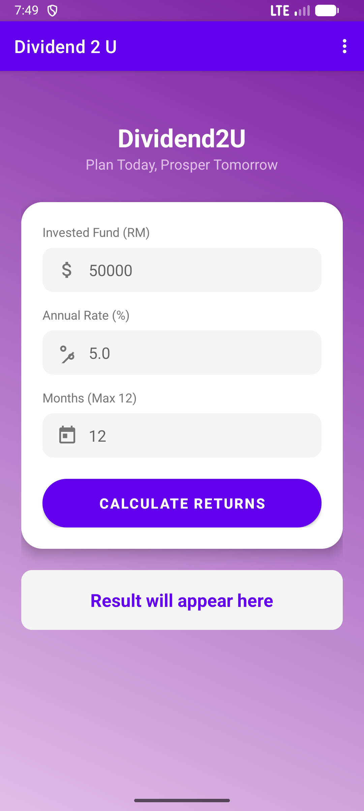
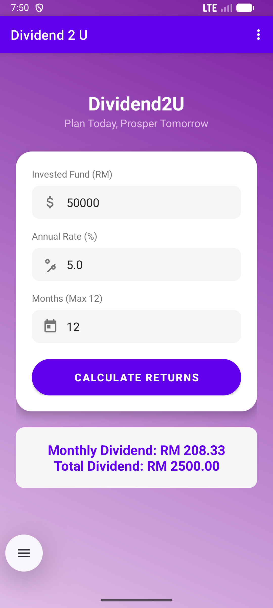
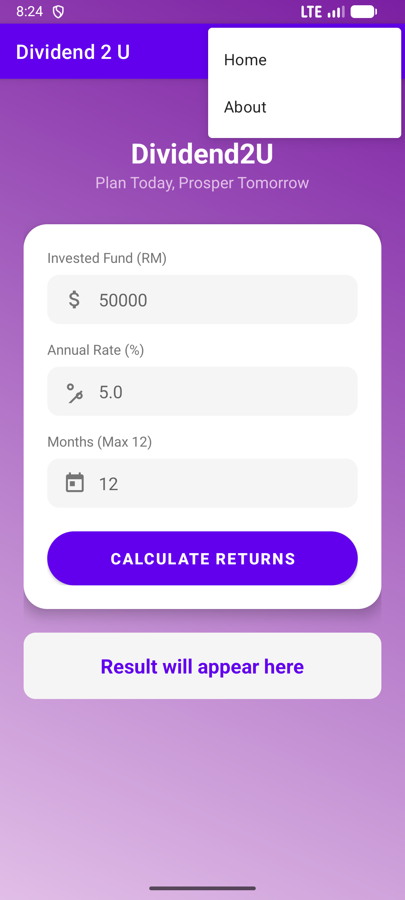

# Dividend 2 U 💰

### A Mobile Application for Unit Trust Dividend Calculation

  

*(Note: If the images don't load, please check the "Screenshots" folder in the code)*

## 📋 Table of Contents
1. [About the App](#-about-the-app)
2. [Student Information](#-student-information)
3. [Features](#-features)
4. [Screenshots](#-screenshots)
5. [Video Presentation](#-video-presentation)
6. [Installation](#-installation)
7. [Requirements](#-requirements)

---

## 📱 About the App
**Dividend 2 U** is a native Android application designed to help investors calculate their returns from Unit Trust investments. It was developed as an individual assignment for the **Mobile Technology and Development** course.

The app accurately calculates:
* **Monthly Dividend:** `(Annual Rate / 12) × Invested Fund`
* **Total Dividend:** `Monthly Dividend × Duration (Months)`

It features a modern, responsive **"Mobile First"** UI built with Material Design components and a custom Purple & White theme.

---

## 👨‍🎓 Student Information

| Field | Detail |
| :--- | :--- |
| **Name** | **[MUHAMMAD IZZAN AIMAN BIN ABDULLAH]** |
| **Matric No** | **[2023216782]** |
| **Course Code** | [ICT602] |
| **Faculty** | [COLLEGE OF COMPUTING, INFORMATIC AND MATHEMATICS] |
| **University** | Universiti Teknologi MARA (UiTM) CAWANGAN KELANTAN |

---

## ✨ Features
* **Smart Calculation:** Instant processing of investment formulas .
* **Input Validation:** Ensures months do not exceed 12 and fields are not empty.
* **Modern UI:** Features a purple gradient background, card-based layout, and custom vector icons.
* **Responsive Design:** Optimized for various mobile screen sizes.
* **Navigation:** Functional "About" page with developer details and GitHub integration .

---

## 📸 Screenshots

| Home Screen | Result & Validation | About Page | Selection Page |
| :---: | :---: | :---: | :---: |
|  |  |  |  |

*(Note to Lecturer: Please see the screenshots folder in the repository for high-resolution images)*

---

## 📺 Video Presentation
A complete demonstration of **Dividend 2 U**, covering the UI design, functionality test cases, and code walkthrough.

### ▶️ [Click Here to Watch the Presentation](INSERT_YOUR_YOUTUBE_LINK_HERE)

---

## ⬇️ Installation
You can download and install the app directly on your Android device:

* 📱 **Download APK:** [Click Here to Download v1.0](https://github.com/iznamn118/Dividend2U/blob/master/app-debug.apk)

*(Note: You may need to enable "Install from Unknown Sources" in your phone settings to install this app.)*

---

## 🛠 Requirements
* **Android Version:** Android 7.0 (Nougat) or higher[cite: 23].
* **Internet:** Not required for calculation (Offline capable).
* **Tools Used:** Android Studio, Java/Kotlin, Git.

---

## © Copyright
© 2025 **[YOUR NAME]**. All Rights Reserved.
