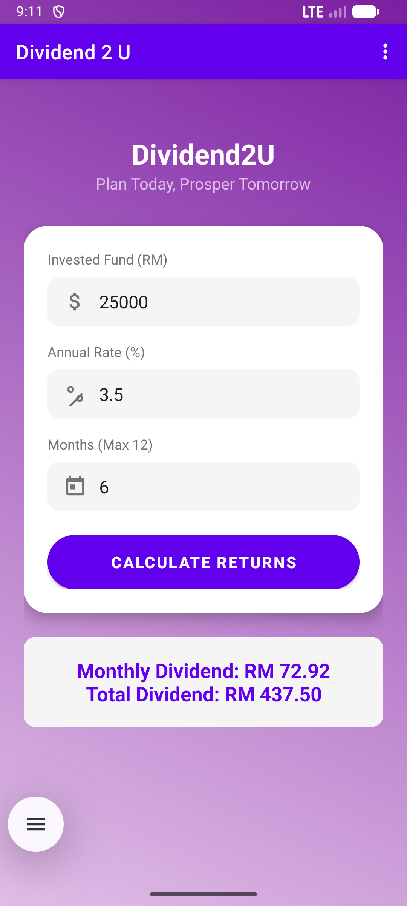
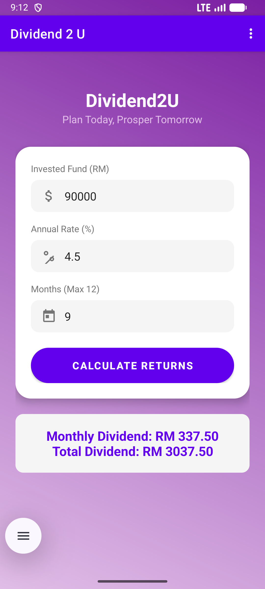

# Dividend 2 U 💰
### *Plan Today, Prosper Tomorrow*

---

## 🧭 Table of Contents

| 🔎 **Explore** | ℹ️ **Info** | ⬇️ **Get Started** |
| :--- | :--- | :--- |
| • [About the App](#-about-the-application)   • [Key Features](#-key-features)   • [Interface Gallery](#-interface-gallery) | • [Student Profile](#-student-profile)   • [Video Presentation](#-video-presentation)   • [Tech Stack](#-tech-stack) | • [Installation Guide](#-installation)   • [Requirements](#-requirements)   • [Copyright](#-copyright) |

---

## 📱 About The Application

**Dividend 2 U** is a native Android financial tool developed to assist investors in accurately calculating Return on Investment (ROI) for Unit Trust funds. Built with a "Mobile-First" philosophy, it ensures a seamless user experience across different device sizes.

### 🧮 How It Works
The app uses industry-standard formulas to compute your earnings:

> **Monthly Dividend** = `(Annual Rate ÷ 12) × Invested Fund`
>
> **Total Dividend** = `Monthly Dividend × Duration (Months)`

---

## 👨‍🎓 Student Profile

| **Student Name** | **Matric Number** | **Course Code** |
| :---: | :---: | :---: |
| **MUHAMMAD IZZAN AIMAN BIN ABDULLAH** | **2023216782** | **ICT602** |

**Faculty:** College of Computing, Informatics and Mathematics  
**University:** Universiti Teknologi MARA (UiTM) Cawangan Kelantan

---

## ✨ Key Features

| Feature | Description |
| :--- | :--- |
| 💸 **Smart Calculator** | Instant real-time calculation of dividends. |
| 🛡️ **Auto-Validation** | Prevents errors by limiting duration to **12 months**. |
| 🎨 **Modern UI** | Beautiful **Purple & White** gradient theme with card layouts. |
| 📱 **Responsive** | Optimized layouts for various screen densities. |
| 🔗 **GitHub Integration** | Direct link to the source code from the "About" page. |

---

## 📸 Interface Gallery

| **Home Screen** | **Calculation Results** | **About Page** | **Selection Page** |
| :---: | :---: | :---: | :---: |
|  |  ⬇️  ⬇️  |  |  |

> *(Note: Please check the `screenshots` folder in the repository for high-resolution images)*

---

## 📺 Video Presentation

Watch the full demonstration covering UI design, functionality test cases, and code walkthrough.

---

## ⬇️ Installation

Ready to test the app? Download the latest APK directly to your Android device.

*(Note: You may need to enable "Install from Unknown Sources" in your Android settings.)*

---

## 🛠 Tech Stack
* **Language:** Java
* **IDE:** Android Studio
* **Version Control:** Git & GitHub
* **Minimum SDK:** Android 7.0 (Nougat)

---

## © Copyright

© 2025 **Muhammad Izzan Aiman Abdullah**. All Rights Reserved.

